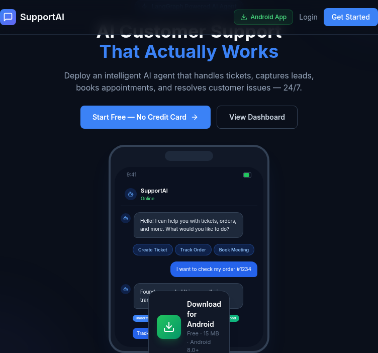

# AI Customer Support Agent

A production-ready AI support agent that **handles real customer conversations**, **creates support tickets**, **checks order statuses**, searches a knowledge base using **semantic vector search**, and **seamlessly escalates to human agents** when needed — complete with an admin dashboard showing live conversation analytics and an embeddable widget companies can add to their site with one line of code.

**Live demo:** [customer.djaouad.tech](https://customer.djaouad.tech)



## Features

- **Multi-turn conversations** with context memory.
- **Tool calling** — create tickets, check orders, search FAQ.
- **RAG-powered knowledge base** with pgvector vector search.
- **Human escalation** with full conversation context.
- **Admin dashboard** with live analytics.
- **Embeddable widget** for any website.
- **Native Android app** (Expo / React Native).

## Architecture

| Part | Stack | Host |
|---|---|---|
| `backend/` | NestJS, Postgres + pgvector, LangGraph agent, OpenAI/OpenRouter | Render |
| `frontend/` | Next.js 14, Tailwind, TypeScript | Netlify |
| `mobile/` | Expo / React Native (Android APK via EAS) | EAS |
| `widget/` | Embeddable chat widget served by the backend | Render |

## Quick start

```bash
# Backend
cd backend
cp .env.example .env   # set DATABASE_URL, JWT secrets, LLM keys
npm install && npm run start:dev

# Frontend
cd frontend
npm install && npm run dev   # set NEXT_PUBLIC_API_URL
```

## Deploy

- **Backend (Render):** `render.yaml` blueprint — web service `ai-customer-support-backend`, root dir `backend`, build `npm ci && npm run build`, start `node dist/main`. Set `sync: false` env vars (`DATABASE_URL`, `OPENROUTER_API_KEY`, `JWT_SECRET`, `JWT_REFRESH_SECRET`) in the dashboard.
- **Frontend (Netlify):** live at `https://customer.djaouad.tech`, built from `frontend/` (`netlify.toml`).
- **Mobile (EAS):** `.github/workflows` builds a preview APK on every push touching `mobile/`; add an `EXPO_TOKEN` secret.

## Environment variables

See `backend/.env.example` — `DATABASE_URL`, `JWT_SECRET`, `JWT_REFRESH_SECRET`, `OPENROUTER_API_KEY` / `OPENAI_API_KEY`, optional `SMTP_*`.

---

Built by [djaouad frih](https://djaouad.tech) — [djaouad.tech](https://djaouad.tech)