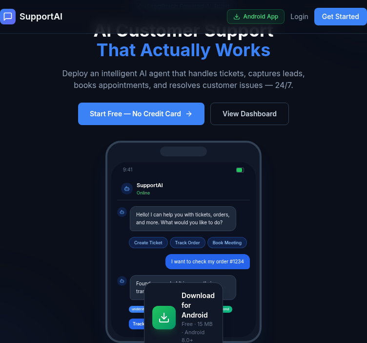
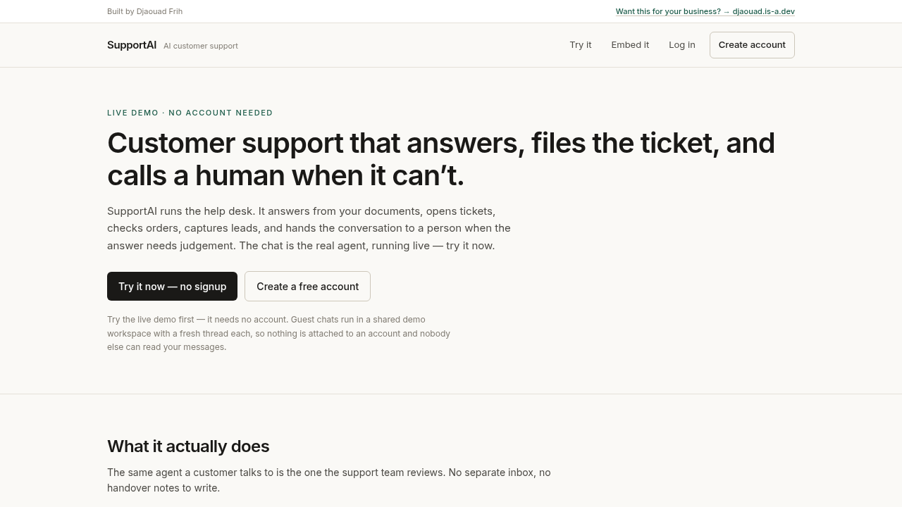
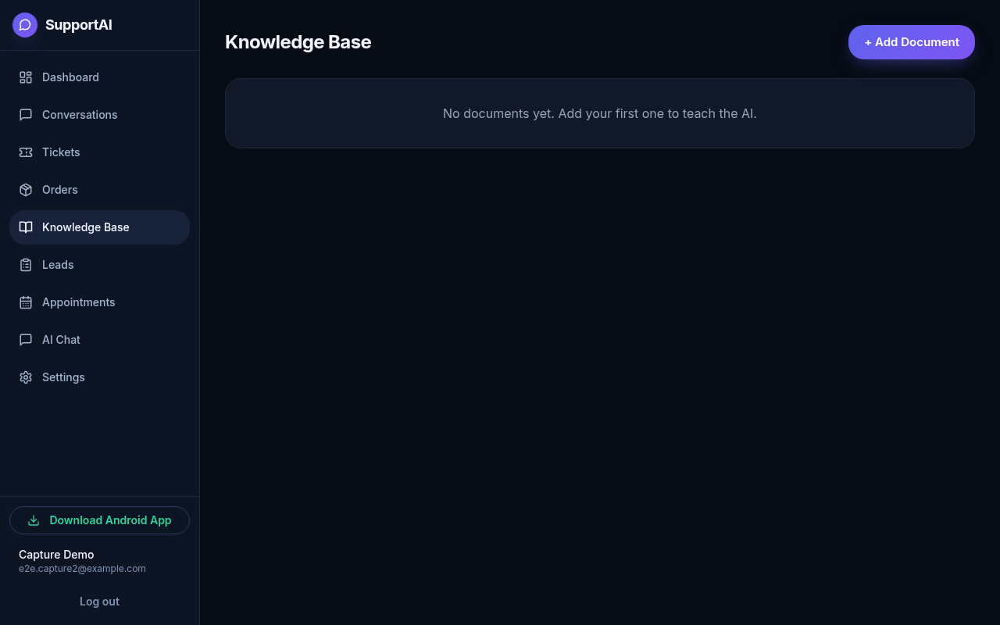
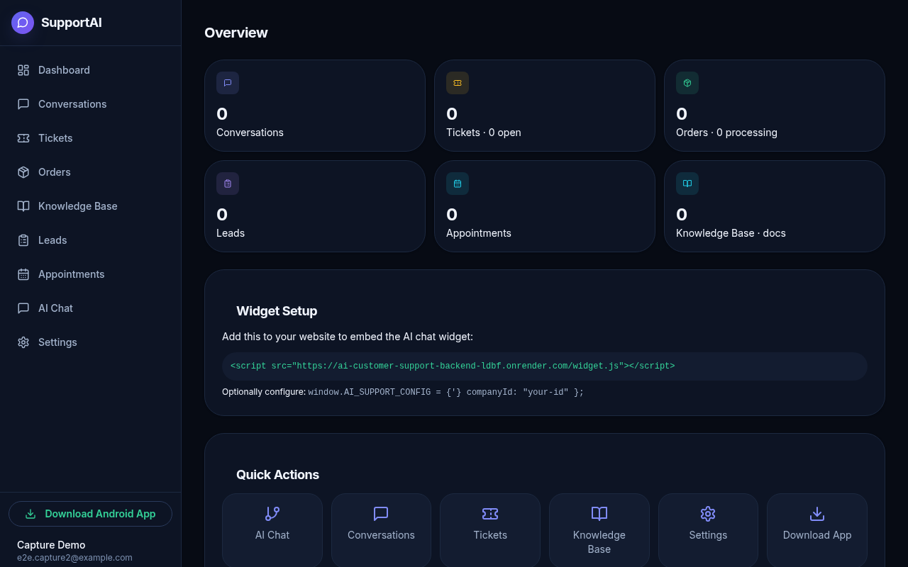
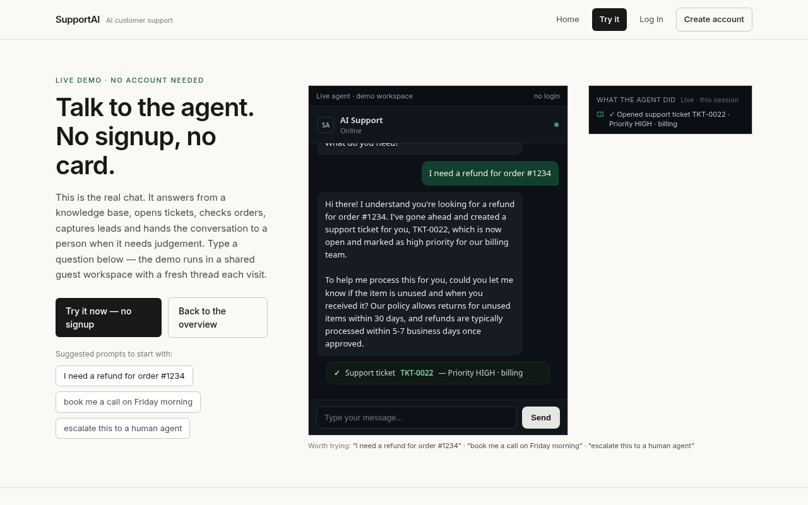

# AI Customer Support Agent

A production-ready AI support agent that **handles real customer conversations**, **creates support tickets**, **checks order statuses**, searches a knowledge base using **semantic vector search** (with an explicit keyword fallback when no embedding key is configured), and **seamlessly escalates to human agents** when needed — complete with an admin dashboard showing live conversation analytics and an embeddable widget companies can add to their site with one line of code.

**Live demo:** [customer.djaouad.tech](https://customer.djaouad.tech)











[Demo video: support flow](screenshots/support-flow.webm)

[Demo video: dashboard](screenshots/support-dashboard.webm)

## Features

- **Multi-turn conversations** with context memory.
- **Tool calling** — create tickets, check orders, search FAQ.
- **RAG-powered knowledge base** — documents are split on paragraph/sentence boundaries (~1000 chars, 200-char overlap) and embedded with OpenAI `text-embedding-3-small`; retrieval is pgvector cosine search (`<=>`) served by an HNSW index. If `OPENAI_API_KEY` is not set, retrieval falls back to lexical keyword scoring and every answer is labelled `retrievalMode: "keyword-degraded"`.
- **Human escalation** with full conversation context.
- **Admin dashboard** with live analytics.
- **Embeddable widget** for any website.
- **Native Android app** (Expo / React Native).

## Architecture

| Part | Stack | Host |
|---|---|---|
| `backend/` | NestJS, Postgres + pgvector, LangGraph agent, OpenAI/OpenRouter | Render |
| `frontend/` | Next.js 14, Tailwind, TypeScript | Netlify |
| `mobile/` | Expo / React Native (Android APK via EAS) | EAS |
| `widget/` | Embeddable chat widget served by the backend | Render |

## Quick start

```bash
# Backend
cd backend
cp .env.example .env   # set DATABASE_URL, JWT secrets, LLM keys
npm install && npm run start:dev

# Optional: create the pgvector extension + HNSW cosine index by hand.
# The app also does this on boot (idempotent, non-fatal).
npm run db:init

# Frontend
cd frontend
npm install && npm run dev   # set NEXT_PUBLIC_API_URL
```

## Deploy

- **Backend (Render):** `render.yaml` blueprint — web service `ai-customer-support-backend`, root dir `backend`, build `npm ci && npm run build`, start `node dist/main`. Set `sync: false` env vars (`DATABASE_URL`, `OPENROUTER_API_KEY`, `OPENAI_API_KEY`, `JWT_SECRET`, `JWT_REFRESH_SECRET`) in the dashboard.
- **Frontend (Netlify):** live at `https://customer.djaouad.tech`, built from `frontend/` (`netlify.toml`).
- **Mobile (EAS):** `.github/workflows` builds a preview APK on every push touching `mobile/`; add an `EXPO_TOKEN` secret.

## Environment variables

See `backend/.env.example` — `DATABASE_URL`, `JWT_SECRET`, `JWT_REFRESH_SECRET`, `OPENROUTER_API_KEY` / `OPENAI_API_KEY`, optional `SMTP_*`.

### Knowledge base retrieval

| Variable | Required | Effect |
|---|---|---|
| `OPENAI_API_KEY` | For semantic retrieval | Embeds documents and queries. Without it the app boots and answers normally, but retrieval degrades to lexical keyword scoring (bounded scan, scored in Node) instead of vector search. |
| `EMBEDDING_MODEL` | No (default `text-embedding-3-small`) | Must return 1536 dimensions to match the `vector(1536)` column; a mismatch is rejected rather than silently stored. |

The retrieval mode is never hidden: `searchChunks()` returns `{ results, mode }` with
`mode: 'vector' | 'keyword-degraded'`, the agent graph carries it as `retrievalMode`, and the
chat payload (socket + `POST /widget/chat`) exposes `retrievalMode` so a degraded answer is
visible instead of posing as semantic search.

Chunks whose `embedding IS NULL` (written before embeddings existed, or during an OpenAI
outage) are re-embedded in bounded batches on the next retrieval, so tenants converge to
vector mode without a migration.

Database side, `PrismaService` runs an idempotent bootstrap on boot (wrapped in try/catch,
logged at warn, never blocks boot):

```sql
CREATE EXTENSION IF NOT EXISTS vector;
CREATE INDEX IF NOT EXISTS chunks_embedding_hnsw ON chunks USING hnsw (embedding vector_cosine_ops);
```

The same two statements are available offline via `npm run db:init` (`prisma/init-vector.ts`).
If the runtime role cannot run DDL, run it once from an admin connection — retrieval still
works without the index, it just does a sequential scan.

---

Built by [djaouad frih](https://djaouad.tech) — [djaouad.tech](https://djaouad.tech)